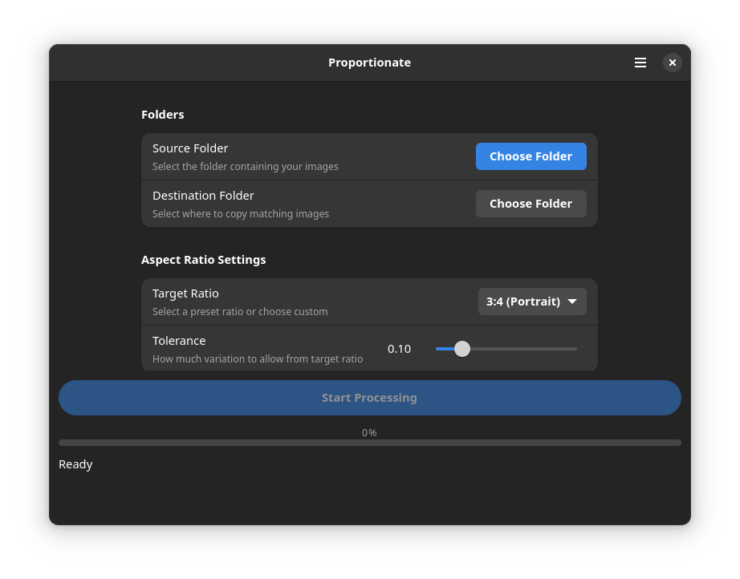

# Proportionate

Proportionate is a GTK4 desktop application for Linux that helps you organize and copy images based on their aspect ratios.

## Features

- Select source and destination folders
- Filter images by aspect ratio
- Supports common aspect ratios (3:4, 2:3, 5:7, 1:1, 4:3, 16:9)
- Custom aspect ratio support
- Tolerance settings for flexibility
- Recursive directory processing
- Real-time progress tracking
- Detailed results view

## Screenshots



## Prerequisites

- GTK 4
- Adwaita
- GLib
- Pthread
- GDK Pixbuf

## Installation

### Dependencies

On Ubuntu/Debian:
```bash
sudo apt-get update
sudo apt-get install libgtk-4-dev libadwaita-1-dev libglib2.0-dev libpthread-stubs0-dev libgdk-pixbuf2.0-dev
```

On Fedora:
```bash
sudo dnf install gtk4-devel libadwaita-devel glib2-devel pthread-stubs gdk-pixbuf2-devel
```

### Compiling

```bash
git clone https://github.com/daftblazer/proportionate.git
cd proportionate
meson setup build
cd build
meson compile
./proportionate
```

## Usage

1. Click "Select Source Folder" to choose the directory containing images
2. Click "Select Destination Folder" to choose where copied images will be saved
3. Select an aspect ratio from the dropdown
   - Choose from predefined ratios
   - Or enter a custom ratio
4. Adjust the tolerance slider to define how strictly the aspect ratio is matched
5. Click "Start" to begin processing

## Supported Image Formats

- JPEG (.jpg, .jpeg)
- PNG
- GIF
- WebP
